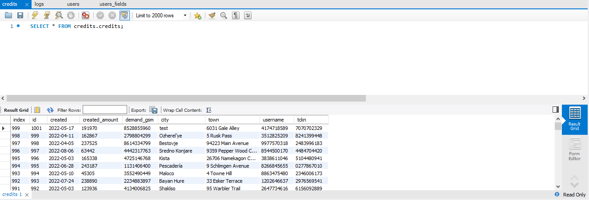
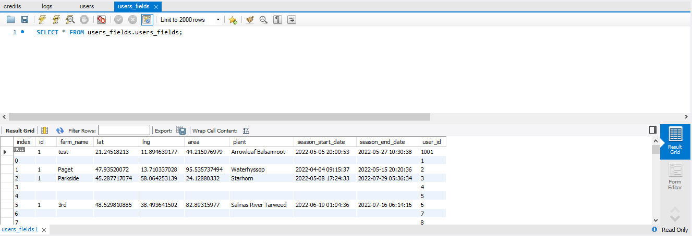
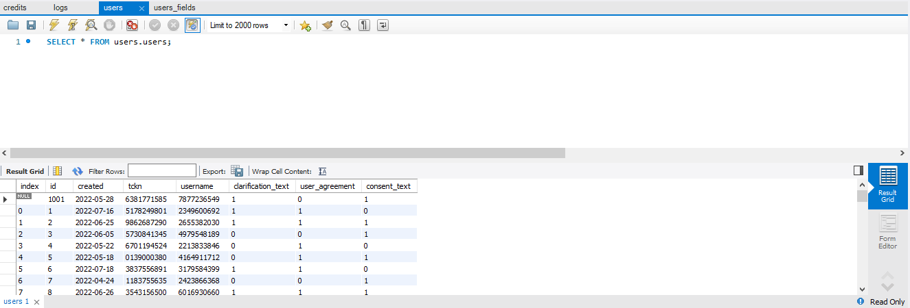
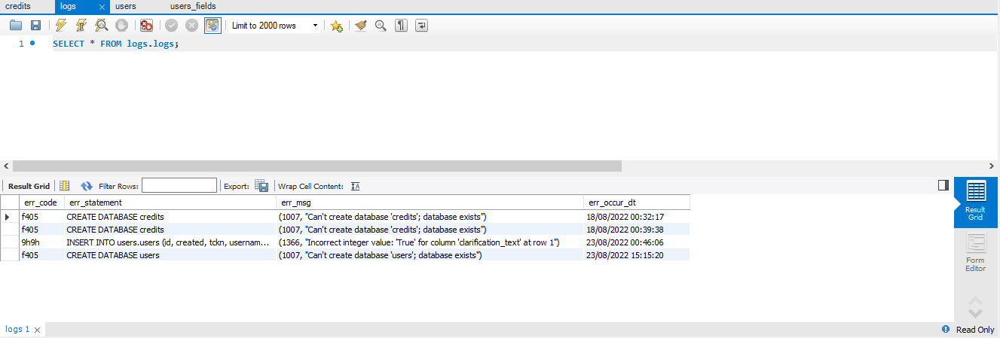

# `JSON-Parse-Pandas`
In this project, the information of users using the bank's mobile application is kept in the database. In 
the application, I wrote a Python code that makes the necessary updates and additions to the database 
when the new user or updated user data comes from an API in json type. I 
worked with the Pandas dataframes and implemented the scenario on the MySQL database. I set up 
JSON Server for API scenario.

## Tech and Libraries

- Pandas
- Numpy
- MySQL
- JSON Server
- SQLAlchemy


## Data

 - [Mock Data](MockData.json)

## API Reference - JSON Server

#### Data About Response

```http
  GET /about
```

| Type     | Description                |
| :------- | :------------------------- |
| `json` | Datas about response status. |

#### User Datas

```http
  POST /response
```

| Type     | Description                       |
| :------- | :-------------------------------- |
| `json` | User datas from API. |


## Screenshots

|  |
| :--:|
| *MySQL Added-Updated New User* |

|  |
| :--:|
| *MySQL Added-Updated New User* |

|  |
| :--:|
| *MySQL Added-Updated New User* |

|  |
| :--:|
| *MySQL Log Table* |

